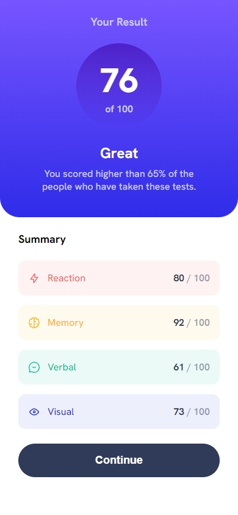
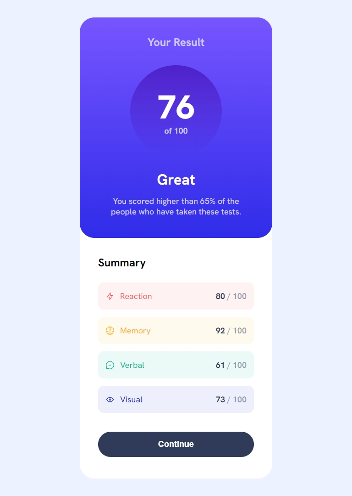
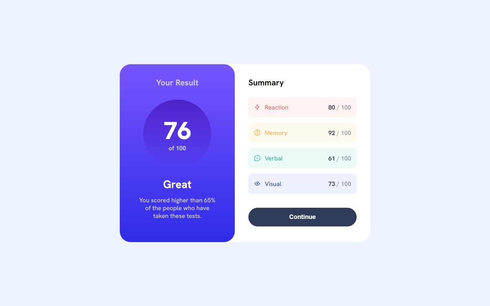

# Frontend Mentor - Results summary component solution

This is a solution to the [Results summary component challenge on Frontend Mentor](https://www.frontendmentor.io/challenges/results-summary-component-CE_K6s0maV). Frontend Mentor challenges help you improve your coding skills by building realistic projects. 

## Welcome! 👋

Thanks for checking out this front-end coding challenge.

[Frontend Mentor](https://www.frontendmentor.io) challenges help you improve your coding skills by building realistic projects.

## Table of contents

- [Overview](#overview)
  - [The challenge](#the-challenge)
  - [Screenshots](#screenshots)
  - [Links](#links)
- [My process](#my-process)
  - [Built with](#built-with)
  - [What I learned](#what-i-learned)
  - [Continued development](#continued-development)
  - [Useful resources](#useful-resources)
- [Author](#author)
- [Acknowledgments](#acknowledgments)

## Overview

### The challenge

Users should be able to:

- View the optimal layout for the interface depending on their device's screen size
- See hover and focus states for all interactive elements on the page
- **Bonus**: Use the local JSON data to dynamically populate the content

### Screenshots

- Mobile



- Tablet



- Desktop



### Links

- Solution URL: [Add solution URL here](https://github.com/welpmoz/results-summary-component/)
- Live Site URL: [Add live site URL here](https://whimsical-kataifi-040fe1.netlify.app/)

## My process

In this challenge, I combined multiple CSS methodologies. The BEM methodology works well for small components and those with shallow HTML structure. However, I also appreciate two key aspects of CUBE-CSS: its exceptions and its naming convention.

For example, in CUBE-CSS, exceptions use the `data-` attribute:

```html
<button data-variant="secondary"></button>
```

And its naming structure follows this pattern:

```html
<section class="block name | composition styles | utilities styles></section
```

To mitigate BEM’s limitations when dealing with highly composable components, I used namespaces. Namespaces add extra layers of structure, offering more flexibility. For instance:

- `c-` for components
- `l-` for layout structures
- `u-` for utility classes

My project folder for styles located in `src/scss` is structured as follows:

- **functions/** 📂
- **namespaces/** 📂  
    - **components/** 📂: All class names in this folder must start with the `c-` prefix.
    - **layouts/** 📂: All class names in this folder must start with the `l-` prefix.
    - **utilities/** 📂: All class names in this folder must start with the `u-` prefix.


### Built with

- Semantic HTML5 markup
- Flexbox
- Mobile-first workflow
- [Sass](https://sass-lang.com/) - CSS extension language
- [React](https://reactjs.org/) - JS library
- [Netlify](https://www.netlify.com/) - Deployment platform

### What I learned

I started to tune in more to accessibility topics. In the following code:

```jsx
export default function ResultCategory({ category, score }) {
	return (
		<li className="c-result__category u-text-body" data-category={category}>
			<span className="c-result__category-name" aria-hidden>
				
				{category}
			</span>
			<span className="u-visually-hidden">
				Your score in {category} category is
			</span>
			<span
				aria-hidden
				className="c-result__category-score u-fw-700 u-fc-dark-navy"
			>
				{score} <span className="u-opacity-50">/ 100</span>
			</span>
			<span className="u-visually-hidden">{score} of 100</span>
		</li>
	);
}

```

You may have noticed the presence of two tags in the form: `<span className="u-visually-hidden">. . .</span>`, and the tag displaying the score in the format score / 100 has the aria-hidden attribute enabled.

As a screen reader user, I use NVDA. The initial code to display `{score} / 100` looked like this: `<span className=". . .">{score} <span className=". . .">/ 100</span>`. When NVDA read it aloud, it said `80 slash 100`. I'm not sure if this is due to some unusual setting I have in NVDA or if this is actually how NVDA (and other screen readers) work. That’s when I started thinking that hearing `80 slash 100` might not provide enough context for the listener.

My first solution was the following code:

```jsx
<span
  aria-hidden
  className="c-result__category-score u-fw-700 u-fc-dark-navy"
>
  {score} <span className="u-opacity-50">/ 100</span>
</span>
<span className="u-visually-hidden">{score} of 100</span>
```

This solution already felt better than the initial code because now NVDA announced `80 out of 100`, but I still wasn’t completely satisfied.

To provide more context for the user, I decided to include the information explicitly, as shown in the following code:

```jsx
<span className="u-visually-hidden">
  Your score in {category} category is
</span>
<span
  aria-hidden
  className="c-result__category-score u-fw-700 u-fc-dark-navy"
>
  {score} <span className="u-opacity-50">/ 100</span>
</span>
<span className="u-visually-hidden">{score} of 100</span>
```

The screen reader now announces `Your score in the reaction category is 80 out of 100.`

### Continued development

En los siguientes proyectos voy a centrarme en aprender como recuperar datos en react.

### Useful resources

- [Namespacing technique](https://csswizardry.com/2015/03/more-transparent-ui-code-with-namespaces/)

## Author

- Github - [Roswell Jaime](https://github.com/welpmoz)
- Frontend Mentor - [@welpmoz](https://www.frontendmentor.io/profile/welpmoz)


